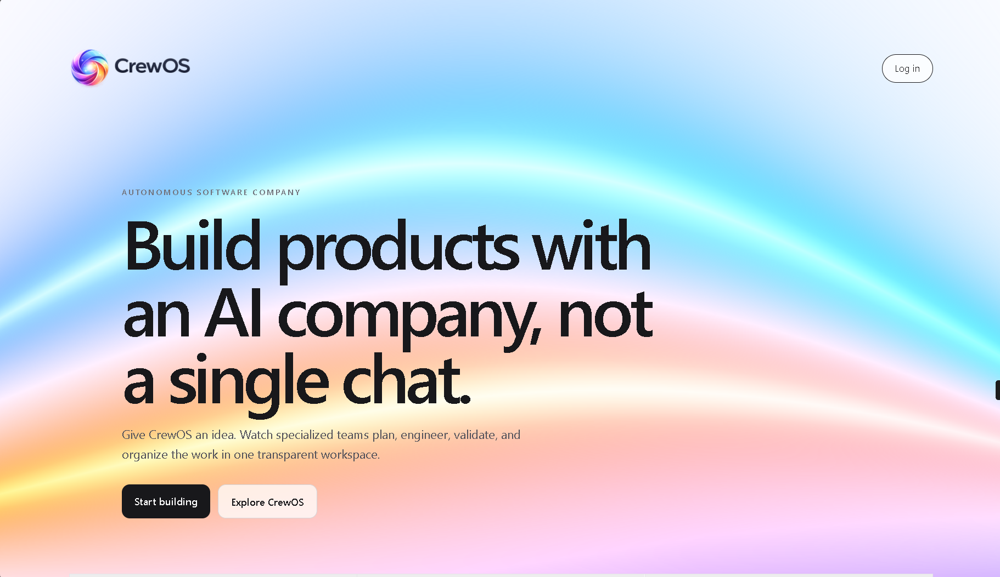
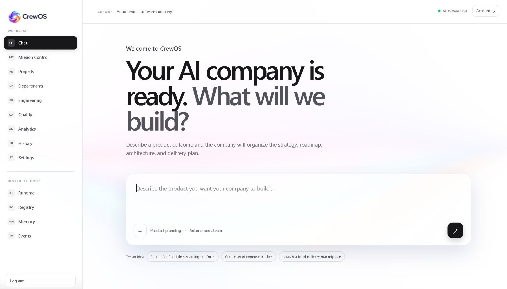
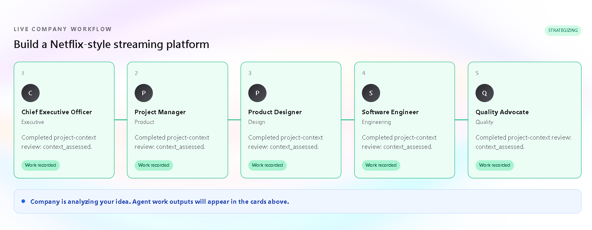
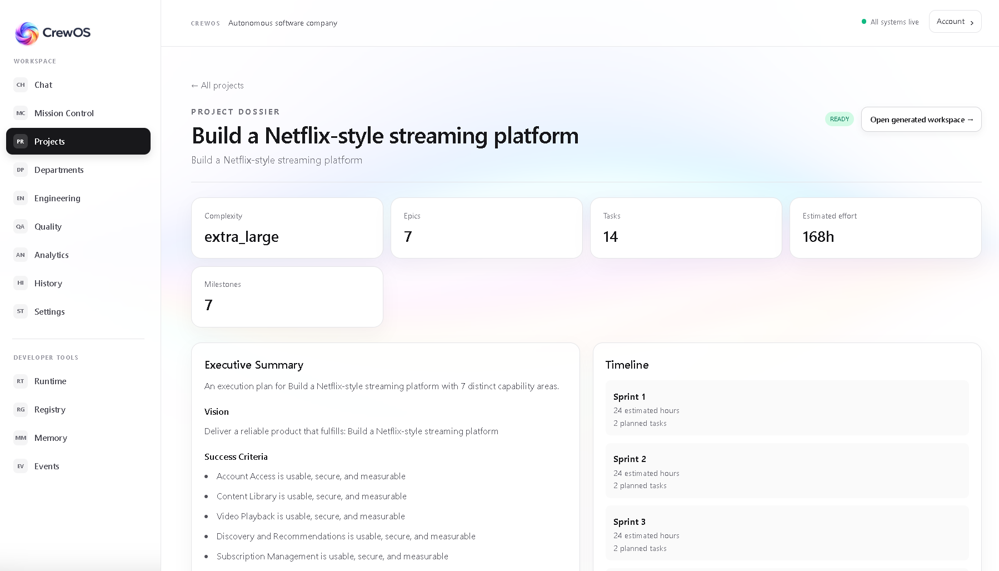
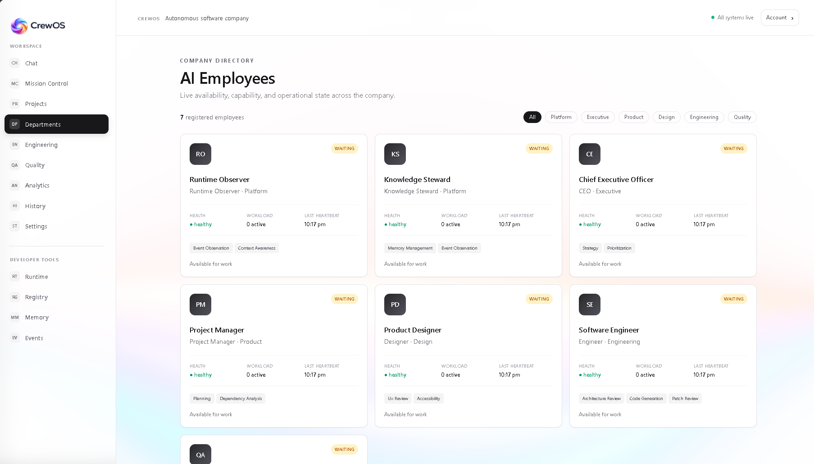

# CrewOS

> An autonomous AI software company that turns a product idea into a project plan, generated workspace, source code, and a live local preview.



CrewOS is a full-stack platform for observing an AI company at work. Start in **Chat** with a product idea; CrewOS plans the work through its runtime, creates a dedicated project workspace, generates source code through Azure OpenAI, and exposes the generated application inside the Engineering workspace.

## How Codex Was Used

Codex accelerated implementation while the project team retained ownership of the product direction, runtime boundaries, and architectural tradeoffs.

### What Codex accelerated

- FastAPI and React scaffolding, API wiring, Pydantic contracts, authentication, and test foundations.
- Enterprise UI implementation for Chat, Projects, Departments, Engineering, source inspection, and embedded live preview.
- Azure OpenAI provider integration, generated-workspace support, patch/diff handling, and project-specific preview routing.
- Debugging bcrypt compatibility, Vite module failures, planning-event feedback loops, stale repository IDs, and preview isolation.

### Decisions owned by the project team

- **Event-driven runtime:** all agents communicate through a reusable event bus rather than direct agent-to-agent calls.
- **Clear responsibility boundaries:** CEO owns strategy, PM owns roadmap planning, Engineering owns generated workspaces/code, and QA remains isolated for validation.
- **Provider abstraction:** Azure OpenAI is behind a code-generation interface so agent logic is not coupled to one vendor.
- **Workspace isolation:** every project owns a separate local source tree and preview process.
- **Product-first experience:** Chat, Projects, Engineering, and visual output are primary; runtime internals remain developer diagnostics.

### Where Codex improved iteration speed

Codex shortened the loop between an idea, a working full-stack implementation, and visible output—especially when repairing runtime event loops, converting generated source into a runnable Vite application, and ensuring each generated project receives its own live preview rather than sharing another project’s UI.

## What it does

- Secure account registration, login, refresh-token support, and protected routes.
- Event-driven runtime with an agent registry, shared memory, context assembly, lifecycle states, and activity events.
- Autonomous project planning: strategy, epics, tasks, milestones, dependencies, timeline, and project archive.
- Project-specific Engineering workspaces with repository tree, readable source files, patch history, and local live-preview support.
- Azure OpenAI-backed code generation provider—kept behind an interface so the runtime is not tied to one model provider.
- Quality Validation Center that runs available unit, static, and integration checks against generated workspaces; failures create assigned bug records and a patch can be revalidated after an engineering update.
- Enterprise-style React UI for Chat, Projects, Mission Control, Engineering, Quality, Analytics, and developer diagnostics.

## Quality loop: validate, report, fix, retest

Quality is a first-class department rather than a decorative dashboard. From **Quality**, select **Run latest validation** after Engineering has produced a patch. CrewOS then:

1. Derives a test plan from the generated workspace and changed files.
2. Runs applicable unit, static, and integration commands.
3. Creates an assigned bug record for each failed command, including output and a reproduction command.
4. Produces an approval or needs-changes quality report.
5. Lets Engineering update the workspace and rerun the same validation flow for regression review.

This loop is visible in the Quality pipeline, Quality Reports, and Bug Center. QA currently requires the validation action from the UI; automatic remediation is intentionally not represented as completed work.

## Feature tour

### Chat: start an AI company from one prompt



Chat is the primary entry point after sign-in. A natural-language product brief activates the company planning workflow—there is no separate “generate tasks” or “generate roadmap” button.

### Live agent workflow: watch the company organize itself



The planning flow makes agent participation visible: the CEO defines strategy, the PM creates the roadmap, and specialist departments contribute context through the runtime event bus.

### Project dossier: preserve every planned outcome



Each completed project becomes a retained company record with its executive summary, vision, epics, tasks, milestones, dependencies, estimated effort, and generated-workspace link.

### Departments: inspect the AI organization



The Departments directory shows the company’s registered AI employees, their department, role, capabilities, health, and current state.

## Architecture

```text
Browser (React + Vite)
        │
        ▼
FastAPI API ────── WebSocket activity updates
        │
        ├── Runtime: Event Bus · Registry · Memory · Context
        ├── Planning: CEO strategy → PM roadmap
        ├── Engineering: Workspace → Azure code generation → Patch → Preview
        └── MongoDB: users, projects, memories and runtime records
```

The application is split into two independently runnable projects:

```text
frontend/                 React, TypeScript, Vite, Tailwind, Zustand, Axios
backend/                  FastAPI, Pydantic v2, Motor, JWT, Passlib
backend/project_workspaces/  Generated project source trees (runtime output)
```

## Prerequisites

- Node.js 20 or later
- Python 3.11 or later
- MongoDB 7 or later
- Azure OpenAI deployment for code generation

## Configuration

Create `backend/.env`:

```env
JWT_SECRET_KEY=replace-with-a-long-random-secret
MONGODB_URI=mongodb://localhost:27017
MONGODB_DATABASE=crewos
CORS_ORIGINS=http://localhost:5173

AZURE_OPENAI_ENDPOINT=https://your-resource.openai.azure.com/
AZURE_OPENAI_API_KEY=your-key
AZURE_API_VERSION=your-supported-api-version
AZURE_GPT_DEPLOYMENT=your-gpt-5.6-deployment
```

For the hackathon demo, configure `AZURE_GPT_DEPLOYMENT` to the Azure deployment backed by **GPT-5.6**. CrewOS does not hardcode a model name: the deployment remains configurable so the provider can be changed without modifying runtime agents.

The frontend uses `http://localhost:8000/api/v1` by default. To override it, add `frontend/.env`:

```env
VITE_API_BASE_URL=http://localhost:8000/api/v1
```

## Run locally

Install and run the backend:

```powershell
cd backend
python -m venv .venv
.\.venv\Scripts\Activate.ps1
pip install -r requirements.txt
uvicorn app.main:app --reload --port 8000
```

In another terminal, install and run the frontend:

```powershell
cd frontend
npm install
npm run dev
```

Open [http://localhost:5173](http://localhost:5173).

## End-to-end demo project

Use this flow for a complete local demo. It requires MongoDB and valid Azure OpenAI credentials in `backend/.env`.

1. Start MongoDB, the backend, and the frontend using the commands above.
2. Open `http://localhost:5173`, select **Start building**, and register a demo account:

   ```text
   Name: Demo Operator
   Email: demo@crewos.local
   Password: CrewOS-demo-2026
   ```

3. In **Chat**, submit this project brief:

   ```text
   Build a premium food delivery marketplace for urban professionals.
   Include restaurant discovery, dietary filters, live order tracking,
   merchant menus, payments, and saved favourites.
   ```

4. Watch the CEO and Product Manager complete strategy and roadmap creation.
5. Open the completed project from **Projects**, then select **Open generated workspace**.
6. In **Engineering**, inspect the generated source tree and open the **Live generated UI** preview.

No seed database is required. The demo account, planning record, event history, workspace, and generated source files are created by this flow. Generated workspaces are stored under `backend/project_workspaces/` and are intentionally ignored by Git.

### Quick API smoke check

With the backend running, verify the service first:

```powershell
Invoke-RestMethod http://localhost:8000/health
```

Expected response:

```json
{ "status": "healthy" }
```

## Product flow

1. Register or sign in. CrewOS opens **Chat**.
2. Describe a product, such as “Build a food delivery marketplace.”
3. The CEO produces a strategy and the PM produces a roadmap, tasks, dependencies, and milestones.
4. Engineering receives the approved plan through the event bus.
5. A real workspace is created under `backend/project_workspaces/<project-id>`.
6. Azure OpenAI generates source files and a patch is recorded.
7. Open the project’s **Generated workspace** to inspect code and view its live preview.

## Tests

```powershell
# Backend
cd backend
pytest

# Frontend
cd frontend
npm test
npm run build
```

## Important notes

- Generated workspaces are local development artifacts. They are not deployed products.
- The code-generation provider requires valid Azure OpenAI credentials; without them, Engineering reports the provider error rather than fabricating files.
- Local previews run independently per generated workspace. They are intended for development review, not production hosting.
- This repository is currently local-first. For judging, provide a hosted instance or private demo credentials/deployment access in the submission notes so reviewers can exercise code generation and QA without configuring their own Azure account.

## Key API areas

| Area | Examples |
| --- | --- |
| Authentication | `/api/v1/auth/register`, `/api/v1/auth/login`, `/api/v1/auth/refresh` |
| Planning | `/api/v1/projects/plan`, `/api/v1/projects/{id}` |
| Runtime diagnostics | `/api/v1/runtime/status`, `/api/v1/agents`, `/api/v1/events` |
| Engineering | `/api/v1/repository`, `/api/v1/engineering/patches` |

## Current scope

CrewOS is a development-stage autonomous software-company environment. Planning, runtime coordination, code generation, workspace inspection, and local preview are included. Production deployment, CI/CD, and customer release automation are intentionally outside this repository’s current scope.
